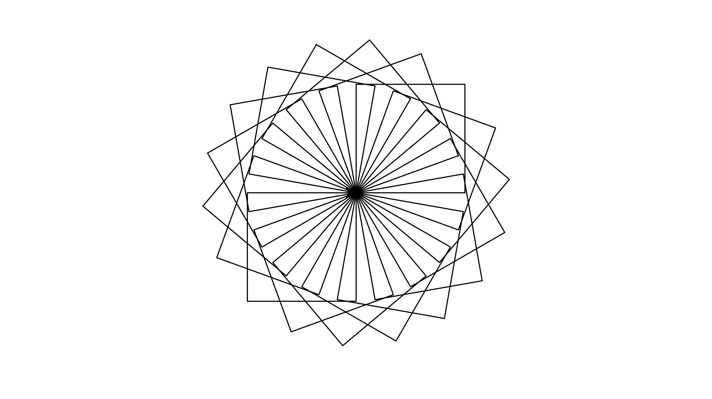

<iframe width="704" height="396" src="https://www.youtube.com/embed/PeGdTwknIfI" title="YouTube video player" frameborder="0" allow="accelerometer; autoplay; clipboard-write; encrypted-media; gyroscope; picture-in-picture" allowfullscreen></iframe>

## Starting Turtle Library 

At first we have to import `turtle` library. In order to import turtle library we will simply use `import turtle`.


```python
import turtle
sandeep = turtle.Turtle()
# Write your code here 
sandeep.forward(100)
# In the end we have to write 
turtle.done()
```

The program creates a turtle named `sandeep`. It starts with the origin $(0,0)$ and moves toward the right $100px$. The image looks as follows


So basically turtle traces a path according to given instruction. 

Similar to `forward`, we can use the following functions to control our drawing according to the name.

- Forward: used as `sandeep.forward(100)` to move $100px$ in forward direction.
- Backward: used as `sandeep.backward(100)` to move $100px$ in backward direction. 
- Left: used as `sandeep.left(60)` to turn $60^\circ$ towards left.
- Right: used as `sandeep.right(60)` to turn $60^\circ$ towards right.

We can directly go to a specified coordinate using `goto` function as `sandeep.goto(100, 100)`

### Creating a Square 

We can use these basic knowledge to draw a square as follows. 


```python
import turtle
sandeep = turtle.Turtle()
# Write your code here 
sandeep.forward(100)
sandeep.left(90)
sandeep.forward(100)
sandeep.left(90)
sandeep.forward(100)
sandeep.left(90)
sandeep.forward(100)
# In the end we have to write 
turtle.done()
```


We can see that there is a loop in the program, so we can use loop to make it short. 


```python
import turtle
sandeep = turtle.Turtle()
# Write your code here 
for i in range(4):
    sandeep.forward(100)
    sandeep.left(90)
# In the end we have to write 
turtle.done()
```

Now we can use function to create a square and then use that function to create more complicated shapes based on square. 


```python
import turtle
sandeep = turtle.Turtle()
# Write your code here 
def square():
    for i in range(4):
        sandeep.forward(100)
        sandeep.left(90)

for i in range (18):
    square()
    sandeep.left(20)
# In the end we have to write 
cv = turtle.getcanvas()
cv.postscript(file="file_name.ps", colormode='color')
turtle.done()
```




