# DAY 5

Today we will learn about control structure and loops. Control structure and loops are fundamental concept in programming. Hence they are implemented in every programmming language. Actully these concepts make a programming language different from calculators. 

[TOC]

## Boolean

Since we have seen that control structure depends on ==test==. Test is nothing but a statement in pyton whose value is either `True` or `False` but not together. For this we have a data type in python to represent this, known as boolean data type. 

### Assigning Boolean Data

``` python
test1 = True
test2 = False
print(test1)
print(test2)
```

``` shell
True
False
```

Many relational operation result in boolean in pyton. For example if we ask following questions?

``` python
test1 = 5 >= 0     # True
test2 = 5 < 0      # False
test3 = 6 == 3     # False
test4 = (6/2 == 3) # Ture, use bracket for better looks
print(test1)
print(test2)
print(test3)
print(test4)
```

``` shell
True
False
False
True
```

We can also check some variable has a particular value or not using this idea. 

``` python
f_name = "Sandeep"
l_name = "Suman"
full_name = f_name + " " + l_name
test1 = (full_name == "Sandeep Suman") 
print(test1)
```

``` shell
True
```

### Boolean Operations

Boolean data has three main operation. Others are combination of them

- **not:** It interchange the value of boolean between `True` and `False`.
- **or:** It takes the logical `or` operation between two boolean statements.
- **and:** It takes the logical `and` operation between two boolean statements.

The result can be summarized in a table as follows

| A | B | not A | not B | A == B | A =! B | A or B | A and B |
|---|---|-------|-------|--------|--------|--------|---------|
| T | F | F     | T     | F      | T      | T      | F       |
| F | T | T     | F     | F      | T      | T      | F       |
| T | T | F     | F     | T      | F      | T      | T       |
| F | F | T     | T     | T      | F      | F      | F       |

``` python 
f_name = "Sandeep"
l_name = "Suman"
full_name = f_name + " " + l_name
test1 = (full_name == "Sandeep Suman") # True 
test2 = not test1                      # not True = False
test3 = (full_name == "Sandeep Suman") or (5 <= 0)  # True OR  False = True
test4 = (full_name == "Sandeep Suman") and (5 <= 0) # True AND False = False
print(test1)
print(test2)
print(test3)
print(test4)
```

``` shell
True
False
True
False
```

## Conditional Statements

Till now all the lines of a program run one by one. The control structure will enable us to run a line based on a ==test==. 

### General Structure 

The structure of general control struructure in python(or in any programming language) will look like the following:

``` python
if <test1>:
    <statement1>
elif <test2>:
    <statement2>
    .
    .
    .
else:
    <final statement>
```

The situation can graphically represented as the following diagram


If we look at another perspective we can think this as the following sequnce of tests



When the i-th test fails, then program check for (i+1)-th test and so on. If any test say k-th one will pass then the program will run the k-th statement will run and program will exit this control structure. If all the statement fails the program will run the final statement nested under `else`. 

### Implementation 

Except the first **if** statement all other are optional. We can combine as many test as we want. 

- **One Test:** The smallest possible program with `if` statement can written as following

    ``` python
    number = 77
    if number > 60:  # colon represent a block in python
        print("1st Devision") # each block need to be indented by 4 whitespace
    ```

    ``` shell
    1st Devision
    ```

    The output is expected. But even if the number $\leq 60$, we will not get any output because the code has no `else` statement.

    ``` python
    number = 55
    if number > 60:
        print("1st Devision")
    ```

    ``` shell

    ```

- **If...else:** We can combine `else` to catch the program when test fails as follows

    ``` python
    number = 55
    if number > 60:
        print("1st Devision") 
    else:
        print("Not 1st Division")
    ```

    ``` shell
    Not 1st Division
    ```

- **Elif:** More than one test can be used using `elif` statement. 

    ``` python 
    number = 37
    if number >= 60:
        print("1st Devision") 
    elif number >= 45:
        print("2nd Division")
    elif number >= 35:
        print("Third Division")
    else:
        print("Fail")
    ```

    ``` shell
    Third Division
    ```

    **Ex:** Change the number to get each type of output.

**Ex:** Write a program that will give the grade of a student based on marks. You can use any criteria for grade.

## Loops

Loops are used to run a block of code again and again based on some condition. There are two kinds of loops most programming language have. 

- **While Loop**
- **For Loops**

### While loop

In python `while` loop is used to run a block of code again and again till a ==test== is true. A simple example of such code is the following.

```python
i = 1

while i < 6: # code in this block run repeatedly
    print(i) 
    i += 1
```

```python
   >>>1
      2
      3
      4
      5
```


### For Loop

A **for** loop in python is used to iterate over a sequence (list ,tuple, string) or other iterable objects.

A simple for loop to print each element of the following

``` python 
numbers = [6, 5, 3, 8, 4, 2, 5] # given list for iteration

for val in numbers: # this code block will run for 
    print(val)      # each element of iterable	
```

``` shell
6
5
3
8
4
2
5
```

A common situation in which `for` loop is used to store the value of a computation for each element of a list. Suppose we want to find sum of each element of a list, then we can write the following code.

```python
numbers = [6, 5, 3, 8, 4, 2, 5] # given iterable
sum = 0  # final value will be stored in sum

for val in numbers: # this code will run each element of list	
    sum = sum + val # we add each element in our sum variable

# after leaving for loop look at indentation
print (sum) # finally print the sum
```

```python
33
```

#### Conditionally Controlling the loop

The `for` loop does not require any ==test== to be performed in the code. But these are theree important cases where `for` is used with a condition. 

- **break:** It will terminates the loop based on a ==test==.

    A common use case is suppose you want to search for some property of element of a list. Then we will break the loop once the condition is met. For example suppose we are looking for number `5` in the given list of numbers.

    ``` python
    numbers = [6, 5, 3, 8, 4, 2, 5] # given iterable

    for val in numbers: # this code will run each element of list	
        if val == 3:    # the for loop will run until this test is satisfied
            break
        print(val)
    ```

    ``` shell
    6
    5
    ```

!!! important 
    You can see that the code will run until the test is satisfied for the first time. 

- **continue:** It is used to skip the rest of the code inside a loop for the current iteration only. Loop does not terminate but continues on with the next iteration.

A common situation is suppose we want to print odd integers only in a given list, then we can skip a code block for even integer as follows

``` python
numbers = [6, 5, 3, 8, 4, 2,5] # given iterable

for val in numbers:  # this code will run each element of list	
    if val % 2 == 0: # checks for even value and  
        continue     # leave the current iteration
    print(val)
```

``` shell
5
3
5
```

- **pass:** It is a null statement. The statements results into no operation. when it is executed,nothing happens. It is useful as a placeholder,when a statement is required syntactically,but no codes need to be executed.

For example we can achieve the above task with the following code with `pass`.

```python
numbers = [6, 5, 3, 8, 4, 2,5] # given iterable

for val in numbers:  # this code will run each element of list	
    if val % 2 == 0: # checks for even value and  
        pass         # leave the current iteration
    else:
        print(val)
```

```shell
5
3
5
```

### Range Function

In loops, **range** is used to control how many times the loop will be repeated. It is used to generate a finite sequence of natural numbers based on three arguemnts. First and last argument is optional. 

The `range` function looks like 

``` python
range(start, stop, step)
```

- **start** states the integer value at which the sequence begins, if this is not included then start begins at 0

- **stop** is always required and is the integer that is counted up to but not included

- **step** sets how much to increase (or decrease in the case of negative numbers) the next iteration, if this is omitted then step defaults to 1

So the range function can be used in three different ways

1. **Using Stop Only:** We can use the range as only one argument as a positive natural number say `n`. It will make a iterable of `n` natural numbers starting with `0`. For example 

    ``` python
    for i in range(5):
        print(i)
    ```

    ``` shell
    0
    1
    2
    3
    4
    ```

2. **Using start and stop:** We can use range function with two arguemnts `start` and `stop`. It will create a iterable of `stop - start` natural numbers with `start`. For example

    ``` python 
    for i in range(5, 10): # create iterable start with
        print(i)           # 5 of length 10 - 5 = 5
    ```

    ``` shell
    5
    6
    7
    8
    9
    ```

3. **Using start, stop and step:** When all three arguement used, it generate a iterable that will began with natural number `start` to `stop - 1` with a `step`. For example

    ``` python
    for i in range(1, 20, 3):
        print(i)
    ```

    ``` shell
    1
    4
    7
    10
    13
    16
    19
    ```

!!! warning
    The `range` doesn't make a list. i.e., if you run this code the output will not be a sequence. 
    ```python
    sequence = range(1, 20, 3)
    print(sequence)
    ```

    ``` shell 
    range(1, 20, 3)
    ```

    In order to get the list. You have to pass this iterable in `list` function.

    ``` python
    sequence = range(1, 20, 3)
    list_sequence = list(sequence)
    print(list_sequence)
    ```

    ``` shell
    [1, 4, 7, 10, 13, 16, 19]
    ```

## References 

1. [:material-file: W3School on If Statements](https://www.w3schools.com/python/python_conditions.asp)
2. [:material-file: W3School on While Loop](https://www.w3schools.com/python/python_while_loops.asp)
3. [:material-file: W3School on For Loop](https://www.w3schools.com/python/python_for_loops.asp)